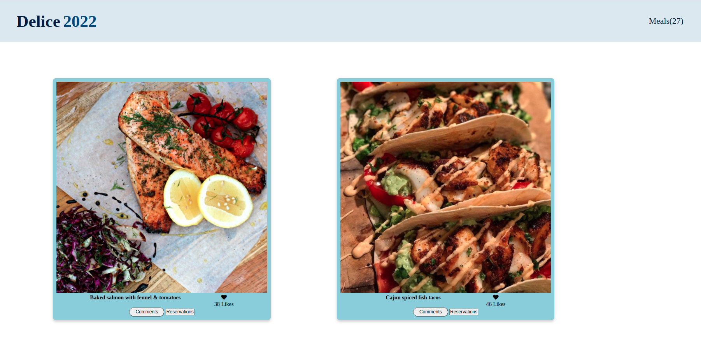

# Fish Dishes




## Built With

- HTML, CSS and Vanilla Javascript

## Live Demo

[Link demo link](https://mehdi-rh.github.io/Fish-dishes-Capstone/)


## Video Presentation

[Video demo](https://www.loom.com/share/d94cb47c28e3407bb69af558e4d8fec6)


## Getting Started

To get a local copy up and running follow these simple example steps.

* Clone the repository: ```git clone git@github.com:Mehdi-Rh/Fish-dishes-Capstone.git```
* ```npm i```
* ```npm start```


## Authors

👤 **Mehdi Rahal**

- GitHub: [@Mehdi-Rh](https://github.com/Mehdi-Rh)
- Twitter: [@MRahal92](https://twitter.com/MRahal92)
- LinkedIn: [mehdi-rahal22](https://www.linkedin.com/in/mehdi-rahal22/)

👤 **Author2**

- GitHub: [Moise Mulungu](https://github.com/moise-mulungu)
- Twitter: [Moise Mulungu](https://twitter.com/moise_mulungu)
- LinkedIn: [Moise Mulungu](https://www.linkedin.com/in/mo%C3%AFse-mulungu-a939831b2/)

👤 **Stanley SIMEON**

- GitHub: [@stanleySimeon](https://github.com/stanleySimeon)
- Twitter [@mstanleyme](https://twitter.com/mstanleyme)
- LinkedIn [LinkedIn](https://www.linkedin.com/in/stanley-simeon-881091224/)

## 🤝 Contributing

Contributions, issues, and feature requests are welcome!

Feel free to check the [issues page](https://github.com/Mehdi-Rh/Javascript-Capstone/issues).

## Show your support

Give a ⭐️ if you like this project!

## Acknowledgments

- Hat tip to anyone whose code was used
- Inspiration
- etc

## 📝 License

This project is [MIT](./MIT.md) licensed.

